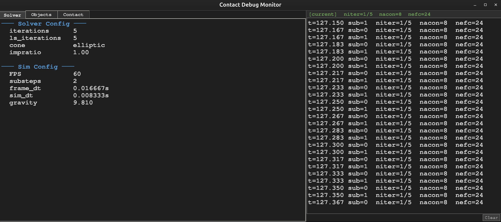
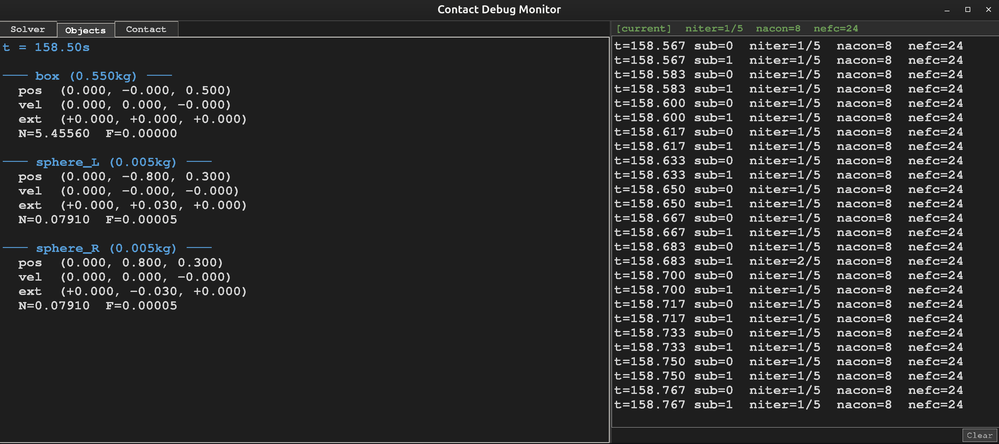
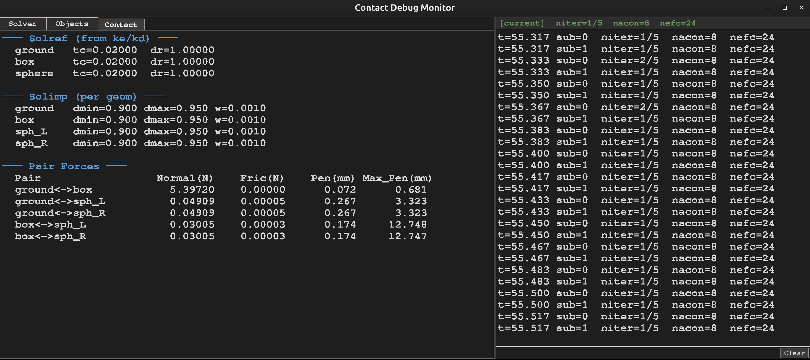

# Contact Force Test

Newton + MuJoCo Warp solver 기반 접촉력(법선/마찰) 측정 및 실시간 디버깅 환경.

## 실행

```bash
cd newton/jk-solver
python jk_solver_examples/contacts/test_contact_force.py
```

## 데모

https://github.com/user-attachments/assets/test_contact_force_video.mp4

<video src="_image/test_contact_force_video.mp4" width="100%" controls></video>

## 시나리오

박스(550g) 1개 + 구(5g) 2개가 바닥 위에 놓인 상태에서:
- 구에 y방향 힘을 가해 박스로 밀어붙임
- 정적/동적 접촉의 법선력·마찰력·침투깊이를 실시간 측정
- Geometric mean 마찰 오버라이드 (`mu = sqrt(mu1 * mu2)`)

## 디버깅 UI

실행하면 Newton 뷰어(왼쪽)와 Contact Debug Monitor(오른쪽) 두 창이 열립니다.

### Contact Debug Monitor

tkinter 기반 좌우 분할 디버깅 창:
- **좌측**: 3개 탭 (Solver / Objects / Contact)
- **우측**: Solver Conv 실시간 로그

---

#### Solver 탭

solver 및 시뮬레이션 설정 요약.



**Solver Config:**

| 항목 | 설명 |
|------|------|
| `iterations` | MuJoCo solver의 최대 반복 횟수. constraint를 풀기 위한 주 반복. 높을수록 정확하지만 느림 |
| `ls_iterations` | line search 반복 횟수. 각 iteration 내에서 최적 step size를 찾는 보조 반복 |
| `cone` | 마찰 cone 모델. `elliptic`(연속 원뿔, 권장) 또는 `pyramidal`(이산 근사, 레거시) |
| `impratio` | friction constraint의 impedance 비율. 1.0이면 법선과 동일, 높이면 마찰 constraint가 더 강해짐 |

---

#### Objects 탭

body별 실시간 상태 모니터.



각 body(box, sphere_L, sphere_R)에 대해:

| 항목 | 설명 |
|------|------|
| `pos` | body 중심의 월드 좌표 (x, y, z) [m] |
| `vel` | body 중심의 선속도 (x, y, z) [m/s] |
| `ext` | body에 가해진 외력 (x, y, z) [N]. 중력 제외, 사용자가 가한 힘 |
| `N` | 해당 body에 작용하는 **법선력 합산** [N]. 모든 접촉 상대의 법선력을 더한 값 |
| `F` | 해당 body에 작용하는 **마찰력 합산** [N]. 모든 접촉 상대의 마찰력을 더한 값 |

---

#### Contact 탭

접촉 파라미터 및 pair별 힘/침투 테이블.



**Solref (from ke/kd):**

ke/kd에서 자동 변환된 MuJoCo solver 응답 파라미터. geom별로 표시.

| 항목 | 수식 | 설명 |
|------|------|------|
| `tc` (timeconst) | `2 / kd` | 접촉 응답 시간 상수 [s]. 작을수록 빠르게 반응 (딱딱한 접촉) |
| `dr` (dampratio) | `kd / (2 * sqrt(ke))` | 감쇠비. 1.0이면 임계 감쇠 (진동 없이 안정), <1이면 진동, >1이면 과감쇠 |

**Solimp (per geom):**

MuJoCo constraint impedance 파라미터. 침투깊이에 따라 constraint 강도를 조절.

| 항목 | 기본값 | 설명 |
|------|--------|------|
| `dmin` | 0.900 | 얕은 침투에서의 impedance (0~1). 높을수록 표면 근처에서도 강하게 반발 |
| `dmax` | 0.950 | 깊은 침투에서의 impedance (0~1). dmax에 가까울수록 constraint가 완전히 활성화 |
| `w` (width) | 0.001 | dmin→dmax 전이 구간 폭 [m]. 작을수록 표면에서 급격히 전환 |

> `D(r) = dmin + (dmax - dmin) * sigmoid(r, width, midpoint, power)` — 침투깊이 r이 커질수록 impedance가 dmin에서 dmax로 증가

**Pair Forces:**

접촉 쌍(body pair)별 실시간 측정값.

| 항목 | 설명 |
|------|------|
| `Pair` | 접촉하는 두 body의 이름 (예: `ground<->box`) |
| `Normal(N)` | 쌍 사이의 **법선력** 합산 [N]. 두 물체를 밀어내는 힘. 정적 접촉 시 ≈ mg |
| `Fric(N)` | 쌍 사이의 **마찰력** 합산 [N]. 접선 방향 미끄러짐을 억제하는 힘. `F ≤ mu * N` |
| `Pen(mm)` | 현재 **침투깊이** [mm]. 두 geom이 겹친 정도. 0이면 표면 접촉 |
| `Max_Pen(mm)` | 시뮬레이션 시작 이후 **최대 침투깊이** [mm]. Reset 시 초기화. GPU atomic_max로 매 substep 추적 |

---

#### Solver Conv 로그 (우측)

매 substep마다 solver 수렴 상태를 기록:

| 항목 | 설명 |
|------|------|
| `niter` | solver가 실제 수행한 iteration 수 / 최대값. 최대에 도달하면 수렴 실패 |
| `nacon` | active contact 수. 실제로 접촉이 발생한 접촉점 개수 |
| `nefc` | constraint 수. 접촉점당 법선 1개 + 마찰 2개 ≈ `nacon * 3` (elliptic cone) |

색상 표시:
- **빨간색**: `niter >= max_iter` (수렴 실패 경고)
- **회색**: `nacon = 0` (접촉 없음)
- 상단 `[current]` 바: 마지막 substep 요약

---

### imgui Param Tuner

Newton 뷰어의 좌측 패널 → **Param Tuner** 섹션에서 실시간 파라미터 조절:

- Solver: iterations, ls_iterations, cone, impratio
- Sim: FPS, substeps, force, gap
- Geometry: gravity, box/sphere 크기·질량·마찰계수
- Contact: ground/box/sphere ke·kd

**Reset** 버튼으로 변경사항 일괄 적용.
